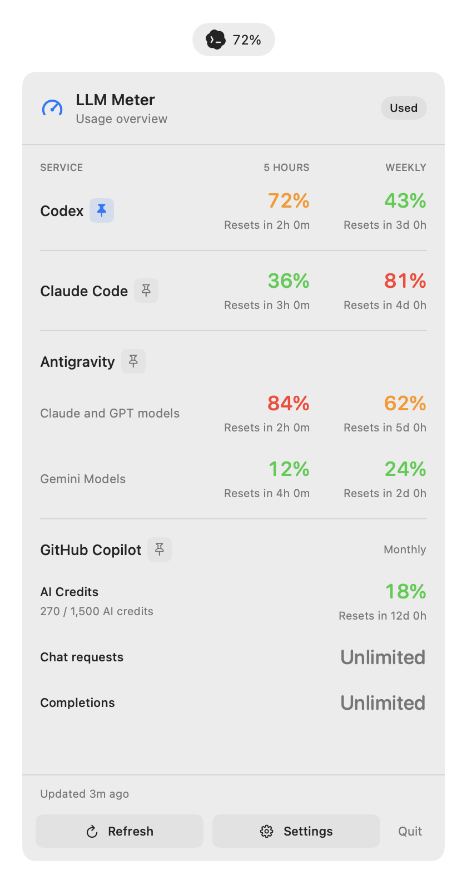
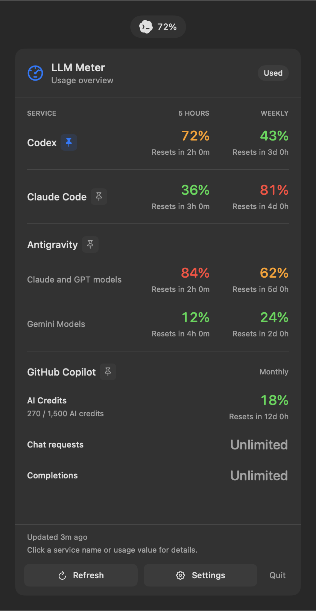
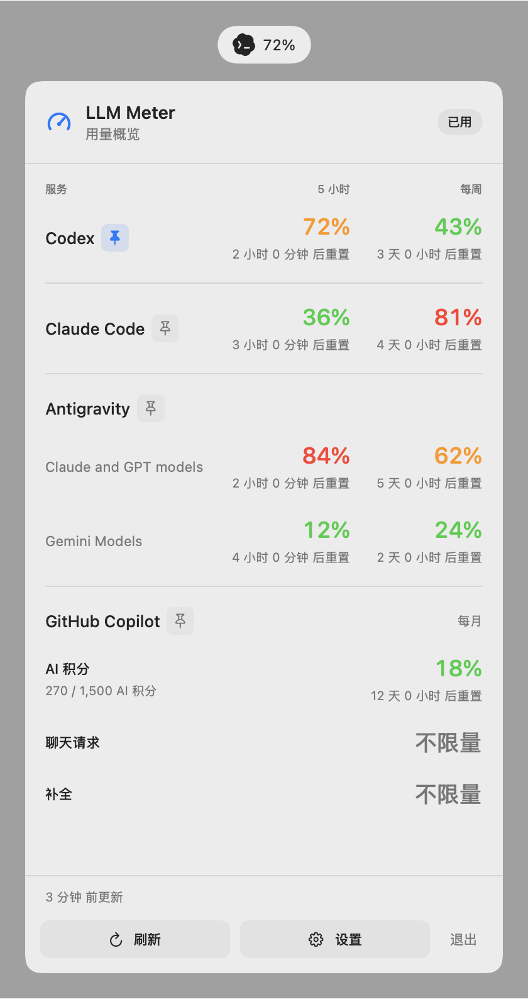
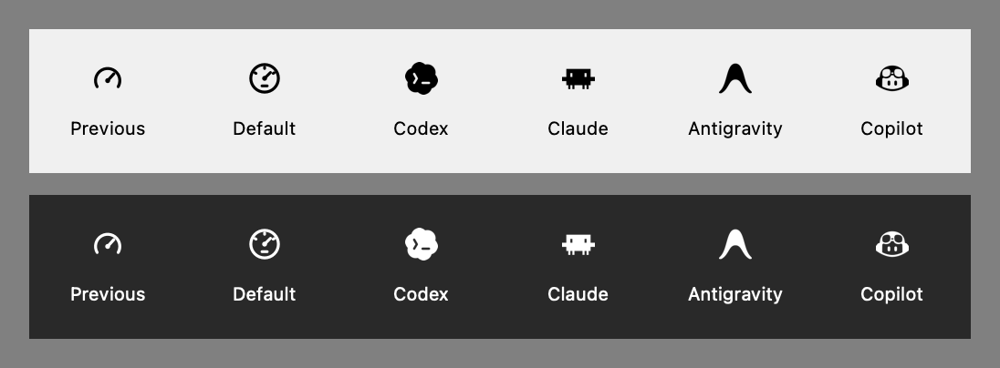
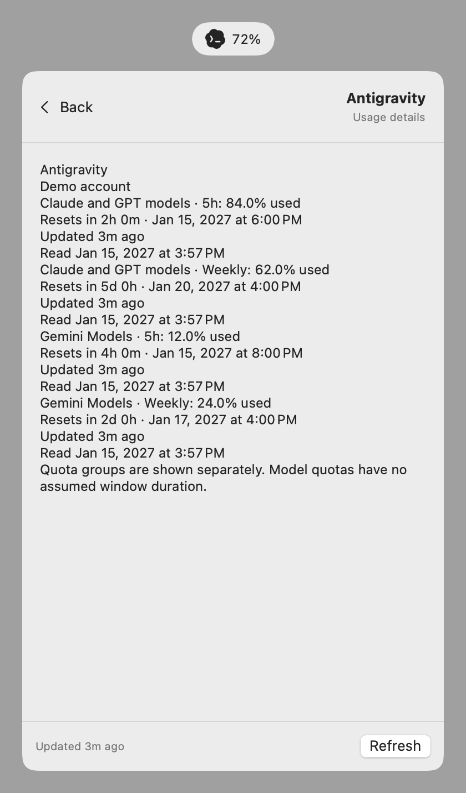

# LLM Meter

**English** | [简体中文](README.zh-CN.md)

A native macOS menu bar utility for LLM usage and remaining allowances. Requires Apple Silicon and macOS 13 or later.




*The native interface with fictional example quotas. Each provider's available windows depend on its source.*

Click the meter icon or usage label to see a compact **5h / Weekly** list. Settings controls which services appear, their order, used versus remaining values, and whether the menu bar shows the default icon or one selected service icon followed by its usage percentage.

Click a service name or usage value to open its full details in a bounded, scrollable panel. Text wraps, can be selected, and updates during refresh. Use **Back** to return to the overview; hover tips contain only a short summary. The footer also explains this shortcut.

Click the small pin beside a provider's name to show that provider in the menu bar immediately. A filled blue pin marks the current selection; an outlined gray pin marks other providers. Switching selects the provider's first available metric; clicking the current provider preserves its selected metric.

Each usage window includes a reset countdown. The footer shows the latest successful update among visible enabled services; hover over it for each service's update age. Open a service's details for exact reset and reading times, masked account details, plan, and errors. Unknown reset times stay unknown; a passed reset shows “Awaiting update” until the source confirms a new allowance. Reset credits are not displayed by the current adapters.

English is the project's working language for documentation, code comments, and development materials.

## Build and Run

Use Xcode 16 or later with Swift 6. If your active developer directory points to Command Line Tools, select Xcode for the command without changing system settings:

```sh
export DEVELOPER_DIR=/Applications/Xcode.app/Contents/Developer
make test
make app
open "build/LLM Meter.app"
```

`make app` creates an arm64 application with a local ad-hoc signature and a `build/LLM-Meter-arm64.zip` archive that preserves executable permissions. `SIGNING_IDENTITY` can supply a Developer ID identity; notarization is a separate distribution step. For launch at login, place the bundle in a stable location such as `/Applications` before enabling the setting.

## GitHub Builds and Releases

[CI](https://github.com/zfdang/llm-meter/actions/workflows/ci.yml) checks Swift formatting and runs the tests on pull requests and pushes to main. [Package macOS app](https://github.com/zfdang/llm-meter/actions/workflows/package.yml) builds and verifies the arm64 app on pull requests, main, and manual dispatch.

Every merge to `main` publishes a release automatically. Its tag is the build date plus the commit's short revision, in `Asia/Shanghai` time, for example `v2026.10.07-3e5e7de`. Each release contains `LLM-Meter-arm64.zip` and its SHA-256 checksum; the bundled app carries the same version string. The run's `LLM-Meter-arm64` artifact keeps the same files for 30 days, and re-running a commit refreshes the release assets instead of creating a duplicate.

Download the ZIP from the [latest release](https://github.com/zfdang/llm-meter/releases/latest) and verify it:

```sh
shasum -a 256 -c LLM-Meter-arm64.zip.sha256
```

These development builds are ad hoc signed and **not notarized**. macOS may block them on first launch: right-click and choose Open, or remove the quarantine attribute. Public distribution requires Developer ID signing and Apple notarization.

## Providers

| Provider | Source | Current support |
| --- | --- | --- |
| Codex | Existing subscription `auth.json`, using `CODEX_HOME` or `~/.codex` by default | Account-level quota windows; live read verified during development |
| Claude Code | Installed `claude` executable, version 2.1.285 or newer | Read-only `/usage` parsing and account checks; subscription sign-in required |
| Antigravity | Running desktop client's local status interface; optional current-token OAuth JSON fallback | Separate quota-group 5h/Weekly rows, model quota fallback, and a selected metric in the menu bar; live local read verified |
| GitHub Copilot | Existing editor sign-in or Copilot CLI configuration and accessible Keychain token | Monthly AI Credits/premium requests, Chat and Completions, including Unlimited; live read verified |

Choose a custom Codex auth file or Claude executable in Settings if automatic discovery does not locate your source. For Antigravity, leave the source path blank (or click **Use default source**), keep the Antigravity app open and signed in, and refresh. The monitor discovers the client's loopback language server and reads status without browser cookies, credential exports, or its own login flow. A custom OAuth JSON remains an optional fallback. No integration copies or rotates refresh tokens. Open the original tool to renew expired credentials.

Copilot supports github.com accounts. It reads existing editor apps.json/hosts.json or CLI config.json (including JSONC), and does not prompt for Keychain access. Select a single-account OAuth JSON file if auto-discovery cannot find accessible credentials. Copilot uses a separate Monthly section; it does not invent 5h/Weekly windows.

Copilot quota reads depend on GitHub's undocumented `/copilot_internal/user` endpoint. GitHub may change or remove it without notice. If access or parsing fails, the app reports the error and retains the last successful reading with its normal stale/expired indicators; the integration may need an update.

Unknown or unsupported periods display `—`. Antigravity's quota groups keep separate 5h/Weekly values; when the client supplies only model quotas, the panel shows each model with an unknown window duration. All metrics are available in the details panel, Settings, and the menu bar metric picker. Claude Code has fixture coverage; its live subscription read still requires a suitable local login source.

The running application’s version and build number are available in **Settings → General** and can be selected and copied. Unbundled development runs show “Development build”.

## Diagnostics

```sh
"build/LLM Meter.app/Contents/MacOS/LLMMeter" --diagnose
```

This reads enabled sources and prints success counts or sanitized errors without storing results or printing credentials. `--settings` opens Settings on launch; `--panel` opens the usage panel.

## Documentation

- [Design](docs/design.md): Product goals, interaction, architecture, and acceptance criteria.
- [Development](docs/development.md): Module boundaries, provider setup, persistence, checks, and current limitations.

## Icon Attribution

Provider icons are adapted from [LobeHub Icons](https://github.com/lobehub/lobe-icons), licensed under MIT. The original SVGs and license are bundled with the application. Logos identify their respective services.

## Language

The interface follows the first language in macOS System Settings → General →
Language & Region. Simplified Chinese (`zh-Hans`, including Chinese mainland and
Singapore regional variants) displays Chinese; all other languages display English.
Restart LLM Meter after changing the system language. Provider and model names remain
as reported by the source. Settings and cached readings are language independent.

<details>
<summary>Simplified Chinese preview</summary>



</details>

<details>
<summary>Default icon and menu bar size comparison</summary>

The default mark uses a full circular gauge with a larger footprint in the same
18-point slot. Template rendering follows the menu bar's light/dark appearance.



</details>

<details>
<summary>Scrollable service details</summary>



</details>
