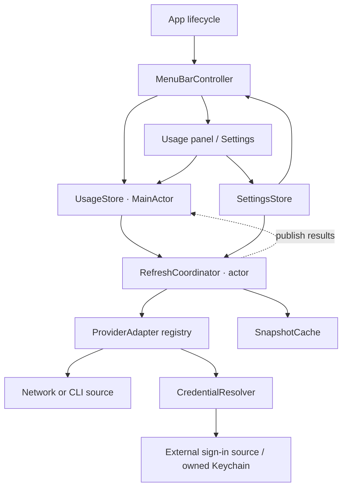

# LLM Meter Design

Status: Design baseline with an initial implementation. See [Development](development.md) for implemented behavior, validation, and remaining work.

Date: 2026-10-07.

Scope: macOS on Apple Silicon (arm64) only. Initial providers: Codex, Claude Code, Antigravity, and GitHub Copilot. The minimum OS version, technology choices, and integration methods may be adjusted after validation.

## 1. Product Goals

LLM Meter is an independent macOS menu bar utility for checking LLM usage and remaining allowances.

Launching the application creates a menu bar item. Clicking it shows usage, remaining allowances, reset times, and reading timestamps for configured services. Users can also display one selected service's usage directly in the menu bar.

The core experience has two parts: **click to view usage across services, and monitor one selected service without clicking.** Settings, connections, and refresh controls support these two tasks.

An “LLM” in the interface represents a service or subscription account, such as Codex or Claude Code. Quotas usually belong to an account, plan, or shared model pool rather than an individual model. Show model-specific metrics only when the source explicitly provides them.

## 2. Feature Scope

### 2.1 Initial Release

| Feature | Behavior |
| --- | --- |
| Menu bar presence | One menu bar item; no Dock icon (`LSUIElement`) or main window on launch by default |
| Default icon | A monochrome open-arc meter icon, suitable for light and dark appearances |
| Selected service usage | Select a service, account, and quota window; show the service icon and percentage |
| Usage panel | A compact list with simultaneous 5h and Weekly columns; services with separate quota groups show one subrow per group |
| Display selection | Select which LLMs appear in the list and configure their order |
| Multiple quota windows | Keep short-term, weekly, and model-pool allowances separate |
| Reset times | Show source-reported reset times and countdowns |
| Automatic and manual refresh | Periodic background refresh, refresh all, and individual source refresh |
| Connection management | Discover supported local sign-in sources; enable, disable, and configure them in Settings |
| Basic settings | Menu bar mode, selected metric, used/remaining display, refresh interval, and launch at login |
| Error and cache states | Distinguish signed out, not yet read, refresh failed, rate limited, unsupported source, and stale data |

Initially, monitor one currently signed-in account per service. Keep account identity in the data model, but defer multiple-account sign-in, switching, and aggregation.

### 2.2 Outside the Initial Release

- LLM conversations, request proxying, local gateways, model routing, and automatic failover.
- Modifying external tools' configuration, switching their accounts, or rotating their tokens on their behalf.
- Reading conversation content, maintaining a local token ledger, estimating costs, historical charts, and data synchronization.
- A plugin marketplace, remote service connections, web UI, TUI, and Windows/Linux support.
- Quota notifications, automatic updates, and extensive themes; evaluate these after the core experience is stable.

## 3. Menu Bar and Panel Interaction

### 3.1 Menu Bar Modes

**Default icon:** A fixed open-arc meter with a needle acts as the application entry point. It does not represent aggregate usage across services.

**Service usage:** Bind a selection to `providerID + accountID + metricID`. Display the selected service's monochrome icon followed by its percentage. The icon identifies the provider and does not encode usage. Used is the default numeric display; selecting remaining adds “left” to the percentage. Full provider names remain in tooltips and accessibility descriptions.

- Include a number so users can read usage without clicking. Replace textual provider abbreviations with one compact service icon.
- Initially select the adapter's declared primary window. Settings allows an explicit weekly or other metric selection.
- Keep the selection stable across refreshes rather than automatically choosing the most-used window.
- For balance metrics, show a short name and amount, such as `API $12.34`. Keep the provider icon beside the value when there is no quota limit.
- If the source only provides percentages, show remaining as a percentage without inferring token or request counts.
- If the target disappears, has no data, or no longer exposes the selected window, show the service icon with `—`, explain why, and offer reselection. Do not silently bind another account.
- Mark retained readings as stale, for example the service icon with `42%·`. Tooltips and the panel show the reading time and current error. After hard expiration, the menu bar shows `—`; the panel retains the historical reading.
- Allow numeric overages such as `105%`; cap remaining allowance at zero.

Keep one menu bar item. Multiple simultaneous services, stacked window labels, and rotating selections are outside the initial release.

### 3.2 Usage Panel

Use a simple menu-style layout: title, usage rows, separators, and actions. Each LLM occupies one row with fixed 5h and Weekly columns. Services with distinct quota groups, such as Antigravity, use a service heading followed by one subrow per source-reported group. Never aggregate independent pools into an account-wide percentage. Avoid expandable cards and permanent progress bars. Use a width of approximately 380 pt to fit reset countdowns, and a content-dependent height with a maximum and scrolling.

```text
┌────────────────────────────┐
│ ◉ LLM Meter                │
├────────────────────────────┤
│ Used           5h   Weekly │
│ Claude Code   72%      35% │
│ Codex         43%      18% │
│ Antigravity     —        — │
├────────────────────────────┤
│ Refresh                    │
│ Settings…                  │
│ Quit                       │
└────────────────────────────┘
```

Values and periods above illustrate the layout only; they are not verified plans or source semantics. Antigravity shows `—` until its periods are validated as genuine five-hour or weekly windows. Future providers (for example, ChatGPT or Gemini) are separate integration targets: a shared account does not justify reusing one quota under two labels.

Default to used percentages and label the header “Used.” When remaining is selected, label it “Remaining” and use the same interpretation in both columns and the menu bar. Right-align values. Add `·` to stale readings and explain the marker in a tooltip. Show `—` for missing, unsupported, or hard-expired metrics, with the reason in the tooltip. Keep existing values during refresh and show progress on the Refresh action.

Hovering over a row or value reveals the masked account, plan, metric scope, exact reset time, countdown, last successful reading time, and error reason. Keep the list itself compact. Map 5h only to an explicitly reported five-hour window and Weekly only to a reported weekly/seven-day window. Do not put daily allowances or monetary balances in these columns. If several model pools share a period, use only an account-wide primary metric explicitly declared by the adapter. Otherwise show `—` and list the pool metrics in the tooltip; do not choose arbitrarily or average them.

For services that provide only a balance or another non-window metric, use the same compact row and span the metric columns with the amount, unit, and “Balance” label. Preserve credits, tokens, and requests as distinct units rather than converting them into percentages.

Clicking the menu bar item toggles the panel. Clicking outside or pressing Escape closes it. Update values in place and preserve scroll position. Settings opens a small native window; closing it leaves the application running. Preserve configured row order rather than sorting by changing usage. With no connections, show “No services connected.” With all connections hidden, show “No LLMs selected for display.” Both states provide a Settings entry point. Refresh updates visible services and the menu bar target; repeated clicks coalesce. Individual source refresh is available in the connection validation area of Settings.

Tooltips include the service, window, used/remaining values, reset time, last successful reading time, and error state. VoiceOver provides equivalent descriptions; color must not be the only status indicator.

### 3.3 Settings

Use three small groups:

1. **Menu Bar:** Default icon/service usage, service and account, quota window or balance metric, used/remaining.
2. **Services:** Visible LLMs, row order, source discovery, monitoring enabled state, source path or executable, connection validation, and removal.
3. **General:** Refresh interval (suggested default: 3 minutes; options: 1/3/5/10 minutes) and launch at login.

Display settings take effect immediately and persist without triggering extra requests. Separate “Show in list” from “Enable monitoring”: a hidden service can remain the menu bar target. Sources that are neither visible nor selected in the menu bar receive no scheduled refresh. Disabling monitoring stops refresh; a disabled menu bar target shows `—` and an explanation. Source changes require revalidation. Removing a connection deletes this application's connection and cache, not the external tool's sign-in information.

## 4. Architecture and Implementation Principles

LLM Meter's own requirements define its product identity, scope, and interaction. During development, other open-source code may inform data access, caching, and platform integration. Technical references do not establish a product relationship or determine feature scope.

- Share usage state between the menu bar and panel; presentation code does not fetch data directly.
- Encapsulate service differences in independent adapters with common quota, balance, and freshness semantics.
- Refresh, cache, and handle failures per source so one failure does not block other services.
- Implement usage reading only, without gateways, routing, account switching, or external token rotation.
- Maintain an independent implementation. Preserve applicable copyright and license notices when reusing third-party code or assets.

## 5. Technology and Program Architecture

### 5.1 Proposed Baseline

Use **Swift + AppKit + SwiftUI**, with a provisional minimum of **macOS 13**, building only for **Apple Silicon (arm64)**.

- AppKit manages `NSStatusItem`, menu bar images and text, `NSPopover`, and application lifecycle.
- SwiftUI renders the compact usage list and Settings window inside native hosts.
- Swift concurrency isolates state and manages asynchronous work; use URLSession for network sources and Process for CLI sources.
- Store application-owned credentials in Keychain and configuration and credential-free usage caches in local JSON.
- Use `SMAppService` for launch at login and reflect actual system authorization in Settings.

The native approach provides direct control over menu bar rendering and popover interaction while keeping runtime and build dependencies small.

Official API references: [NSStatusItem](https://developer.apple.com/documentation/appkit/nsstatusitem), [NSPopover](https://developer.apple.com/documentation/appkit/nspopover), and [SMAppService](https://developer.apple.com/documentation/servicemanagement/smappservice). Validate signatures and deployment compatibility against the selected Xcode SDK during implementation.

### 5.2 Module Boundaries



| Module | Responsibility |
| --- | --- |
| App | Startup/shutdown, single instance, sleep/wake, and exit cleanup |
| MenuBarController | Icon and label rendering, tooltips, and panel toggling; no direct fetching |
| UsageStore | Publish common service state to the menu bar and panel; UI changes run on MainActor |
| RefreshCoordinator | Scheduling, request coalescing, concurrency limits, timeouts, backoff, and result version checks |
| ProviderAdapter | Discover sources, fetch raw data, and normalize service-specific metrics |
| CredentialResolver | Read authorized sources on demand without exposing secrets to UI or caches |
| SettingsStore | Configuration validation, schema migration, and atomic saving |
| SnapshotCache | Retain the latest successful snapshot; failures cannot overwrite valid data |

Use one application process, without a local HTTP server, persistent helper daemon, or plugin host. Network and subprocess work must not block the UI. Continue scheduled refreshes for enabled sources that are visible or selected in the menu bar when the panel is closed.

### 5.3 Proposed Directory Layout

```text
LLMMeter/
  App/                  Lifecycle and native menu bar controller
  UI/                   Usage panel, Settings, and icon rendering
  Domain/               Accounts, metrics, snapshots, and state models
  Providers/            Adapter protocol and provider implementations
  Services/             Scheduling, credentials, network, and CLI execution
  Persistence/          Configuration, caches, and migrations
  Resources/            Icons and localization
LLMMeterTests/           Parsing, state, and scheduling tests
docs/
  design.md
```

The SwiftPM implementation separates `Sources/LLMMeterApp` and `Sources/LLMMeterCore`; see [Development](development.md) for the actual module layout.

## 6. Data Model and Usage Semantics

### 6.1 Core Objects

| Object | Key fields |
| --- | --- |
| ServiceConnection | Stable connectionID, providerID, source type and reference, enabled, visibleInList, order, display name |
| AccountIdentity | Stable accountID, masked display name, optional plan; no email or token as the persistent primary key |
| UsageSnapshot | connectionID, accountID, metrics, readAt, optional sourceUpdatedAt, complete/partial marker, source type |
| UsageMetric | Stable metricID, name, kind (quota/balance), scope (account/model/pool), unit, used/limit/remaining/percentage, resetAt |
| ServiceState | Last successful snapshot, refreshing flag, last attempt time, error category, next permitted refresh time |
| MenuBarSelection | Mode, connectionID, accountID, metricID, used/remaining display |

Numeric fields are optional: `nil` means unknown; zero means a confirmed zero. Represent unlimited allowance explicitly with `unlimited`. Distinguish “Unknown,” “Unlimited,” and “Not applicable.” Store absolute timestamps with time zone information and display them in the user's local time zone.

`readAt` records this application's successful read, not a guarantee that source data is current. Preserve source-provided update timestamps separately as `sourceUpdatedAt`. CLI output or partial responses must not update reading timestamps for unreported metrics.

### 6.2 Calculation Rules

- For used amount `U` and limit `L > 0` in the same window, used percentage is `100 × U / L` and remaining is `max(0, L - U)`.
- With only used percentage `P`, remaining percentage is `max(0, 100 - P)`; absolute amounts remain unknown.
- Prefer provider-reported metrics. Preserve source semantics when reported and derived values disagree; do not combine different accounting scopes.
- Never substitute zero for a missing percentage. Treat NaN, infinite values, and invalid limits as parsing errors. Preserve valid overages, but clamp graphical fill to 0–100%.
- Show short-term and weekly windows independently, without adding or averaging them. Do not double-count shared model pools.
- A balance does not establish past spending or imply a reset time.
- Convert relative reset seconds into an absolute timestamp when reading, rather than adding them to the current time on each render.
- If a reset time has passed without new data, mark the metric “Awaiting update” and trigger one rate-limited refresh. Do not reset usage to zero locally.
- Partial snapshots update only reported metrics. Keep old timestamps and mark missing metrics for confirmation. Remove omitted metrics only when the adapter explicitly identifies a complete response.

## 7. Provider Integration Strategy

Initial support targets are **Codex, Claude Code, Antigravity, and GitHub Copilot**. All four are included in initial implementation and acceptance scope. Validate access methods during integration; add other providers later.

| Provider | Candidate access method | Required validation |
| --- | --- | --- |
| Codex | Read an authorized local sign-in source and query its quota source | File/Keychain differences, account identity, quota windows, token expiration, and endpoint availability |
| Claude Code | Use the local tool's usage command; candidate: `claude -p /usage` | Installed version support, quota-only behavior, exit codes, output format, language, dates, and time zones |
| Antigravity | Read the running client's local status and quota summary RPCs; optional existing OAuth JSON fallback | Account identity, current-user process and loopback listener discovery, model/shared-pool scope, reset periods, weekly availability, and refresh limits |
| GitHub Copilot | Existing editor/CLI sign-in, then read the github.com account identity and quota endpoint | Monthly billing units, unlimited versus unknown quotas, identity checks, accessible Keychain credentials, and old-settings migration |
| Future providers | Prefer explicit usage/balance APIs or the tool's own query interface | Authentication, accounting scope, rate limits, and minimum permissions; an inference API key does not imply subscription quota access |

The candidate Codex path `/wham/usage` is an internal client endpoint, not a stable public API contract. Validate Claude's behavior against the installed official tool. In particular, confirm that `claude -p /usage` is handled locally as a slash command: if a CLI version does not recognize it in print mode, the text may be sent to the model as a prompt and consume the very quota being measured. The adapter must check the CLI version against a validated range and must never fall back to an inference request. Record source versions and redacted response fixtures. If validation fails, show “Unsupported source” rather than guessing how to parse it.

Adapters expose `discoverSources()`, `fetchUsage(source)`, and `capabilities`. Capabilities declare supported metrics, a primary metric, complete-snapshot support, and minimum automatic/manual refresh intervals. The UI must not assume every service has both five-hour and seven-day windows.

Read external credentials on demand. Do not copy refresh tokens, modify external sign-in files, or rotate external tokens. On unreadable credentials or expiration, direct users to sign in again through the original tool, then reread the source. Prefer the tool's own session for CLI sources without separately importing its secrets.

Resolve CLI executable paths from validated sources or Settings rather than relying on Finder's limited PATH. Execute a binary with an argument array, not a shell command string. Bound execution time and output size; terminate subprocesses on cancellation. Check account identity before and after execution and discard results obtained during account changes.

## 8. Refresh, Caching, and Failures

### 8.1 Refresh Flow

1. Load configuration and the latest successful snapshots on launch, then create the menu bar item immediately.
2. Discover configured sources and confirm account identity. Until confirmation, disk snapshots are labeled as readings from the previous account, not valid current-account readings.
3. Refresh enabled sources that are visible or selected in the menu bar asynchronously. Allow one in-flight fetch per source, with a overall concurrency limit of four.
4. Before publishing a successful result, check connection configuration version, account identity, and request sequence. Then save the snapshot and update the menu bar and panel.
5. On failure, retain the last successful data and timestamp, update the error state, and schedule according to error category.

The automatic interval is `max(user interval, adapter minimum interval)`, with modest jitter. Suggested single-fetch timeouts: 20 seconds for network sources and 30 seconds for CLI sources, with stricter limits where appropriate.

Opening the panel immediately shows cached data and refreshes due sources. Manual refresh may bypass the normal interval but must respect rate-limit cooldowns and adapter manual minimums. Join an existing in-flight request rather than starting another. A suggested manual minimum for ordinary network sources is 15 seconds; determine CLI minimums during integration.

Pause scheduling during sleep. On wake, refresh each due source once rather than replaying missed intervals. On network recovery, retry only sources requiring updates. Cancel work on exit or source removal; late results must not restore deleted rows or overwrite new configuration.

### 8.2 State Rules

Track data freshness separately from refresh outcome. A service may have both a previous snapshot and a failed latest refresh. Refreshing must not clear existing data.

| Condition | Presentation and action |
| --- | --- |
| First read | Show loading when no data exists; the menu bar target shows `—` |
| Signed out/unreadable credentials | Explain the connection problem and offer the original tool's sign-in entry point; stop frequent retries |
| 401/403 | Show sign-in required or access denied; avoid endless retries |
| 429 | Honor Retry-After; if absent, use exponential backoff up to 30 minutes |
| Network/timeout/5xx | Retain the snapshot, mark failure, and apply exponential backoff with jitter |
| Output format changed | Show a parsing failure, not empty data or zero allowance |
| Partial data | Track successful and pending metrics independently, retaining missing metrics' original timestamps |
| Source/account change | Isolate previous-account cache and cancel old requests; show `—` for a new account without data |
| Corrupt configuration/cache | Preserve the original file and report the error; do not automatically overwrite it with empty configuration |

Suggested soft expiration: `max(2 × effective refresh interval, 10 minutes)`. Suggested hard expiration: `max(4 × effective refresh interval, 30 minutes)`. Soft-expired data or a failed latest refresh receives a stale marker. After hard expiration, hide the menu bar value and retain historical readings with timestamps in the panel. Passing a window reset time immediately makes that metric pending confirmation, without waiting for hard expiration.

## 9. Local Storage and Distribution

Store configuration and caches in `~/Library/Application Support/LLM Meter/`:

- `settings.json`: schemaVersion, source references, display selection, and refresh settings.
- `usage-cache.json`: schemaVersion, latest successful snapshots, and reading times; no tokens, API keys, or raw responses.

Write through temporary files and atomic replacement. Restrict access to the current user: suggested permissions are 0700 for the directory and 0600 for files. Reject writeback for unknown newer schemas and explain incompatibility to avoid destructive downgrade writes. Store application-owned secrets only in Keychain, with references in configuration. External tools retain ownership of their credentials.

Do not upload data, collect conversation content, or scan unrelated directories by default. Logs contain only source IDs, durations, and error categories, without authentication headers, full identity details, or raw CLI output.

Initially distribute a signed and notarized `.app` directly. Do not base the first release on Mac App Store sandboxing: validate external source access and CLI execution under actual permissions. Explain Keychain authorization failures without attempting to bypass system permissions. Validate development functionality before configuring Developer ID signing, notarization, and launch at login.

## 10. Implementation Stages and Acceptance

### Stage 1: Native Shell and Mock Data

Create the macOS project, menu bar entry, fixed icon, mock 5h/Weekly list, Settings window, and service-icon usage mode. Validate toggling, keyboard interaction, light/dark appearance, display scaling, and constrained menu bar space. Clearly label mock data and keep it separate from real services.

### Stage 2: First Real Source

Validate Codex access paths, identity, and quota queries, then implement its adapter, caching, and scheduling. If source validation fails, record why and revise the access approach; mock data does not count as an integrated source.

### Stage 3: Remaining Initial Sources and Failure States

Validate Claude Code's usage command, Antigravity's usage source, and GitHub Copilot's monthly quota response, then implement separate adapters. Complete multiple-window handling, model/shared-pool metrics, account-change handling, partial responses, rate limiting, and stale-data display. Map periods according to actual source semantics rather than relabeling monthly or other periods as 5h or Weekly. Limit implementation to usage queries and presentation.

### Stage 4: Packaging

On Apple Silicon Macs, validate launch at login, single-instance behavior, exit cleanup, and permission messages. Complete arm64 builds, signing, and notarization.

**Acceptance criteria:**

- Codex, Claude Code, Antigravity, and GitHub Copilot pass real-source integration validation and can be selected for the list and menu bar metrics.
- Launch creates one menu bar item; initial network waits do not block its appearance or panel interaction.
- Default mode uses the open-arc meter icon. Usage mode fixes an account and metric and correctly displays used or remaining values.
- The panel includes only selected LLMs, with simultaneous 5h and Weekly columns; unknown and unsupported periods show `—`. Copilot's source-reported monthly quotas have explicitly labeled monthly rows.
- Display selection and order survive restart. Hidden services can remain menu bar targets; sources neither displayed nor selected receive no scheduled refresh.
- The menu bar and panel share snapshots and update together after refresh.
- Offline, expired, rate-limited, signed-out, and parsing-failure states are distinguishable without losing the last successful reading.
- Passing a reset time does not locally assert renewed allowance. Results from an old source/account cannot overwrite a new account.
- Automatic refreshes do not overlap or bypass source cooldowns; panel closure and sleep/wake follow scheduling rules.
- Restart restores settings and caches; corrupt files are not overwritten with empty configuration.
- External credentials, configuration, and active accounts remain unchanged; logs and caches contain no secrets.

Use redacted fixtures and a fixed clock for tests. Cover percentages, absolute amounts, overages, unlimited and unknown values, partial responses, time zones and dates across year boundaries, account changes, discarded late results, request coalescing, and backoff. Validate native UI manually on macOS. Verify real integrations using valid local sign-ins; CI must not require personal credentials.

## 11. Decisions Requiring Validation

Proceed with these baselines: Apple Silicon (arm64) only, provisional macOS 13 minimum, native Swift application, initial Codex/Claude Code/Antigravity/GitHub Copilot integrations, one current account per service, and one menu bar usage target.

Validate local credential storage formats, CLI versions and behavior, source permissions and refresh limits, and external source access after signing. Decide future provider priorities, independent sign-in, multiple-account support, and balance APIs after initial integration validation.
